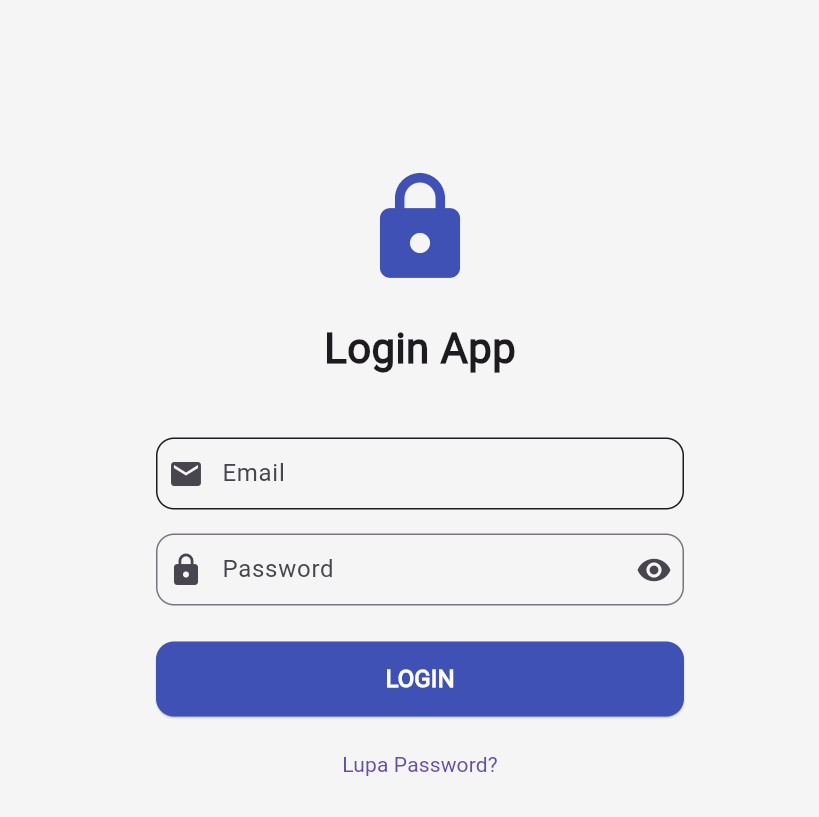
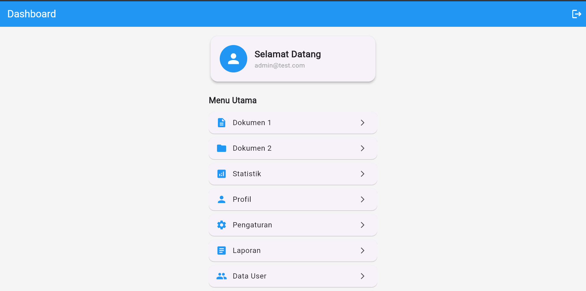
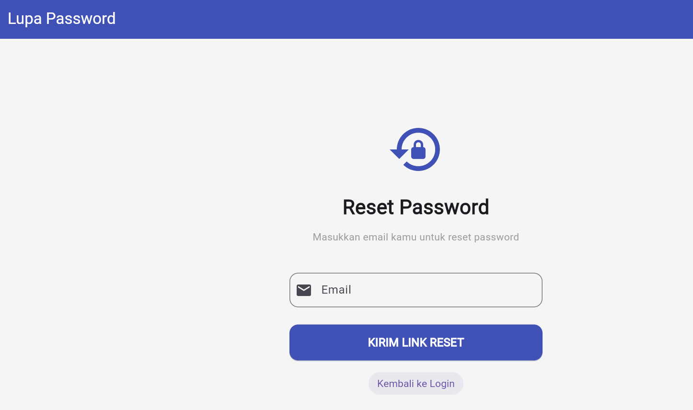

# Aplikasi Login UTS - Flutter

### 1. Deskripsi Aplikasi
Aplikasi login sederhana dengan 3 halaman: Login, Dashboard, dan Lupa Password. Dibuat untuk memenuhi tugas UTS Pemrograman Mobile.

### 2. Daftar Fitur
- Form Login dengan validasi Email & Password menggunakan `GlobalKey<FormState>`
- Validasi: Email tidak boleh kosong, format email harus valid, password minimal 8 karakter + huruf + angka
- Loading indicator `CircularProgressIndicator` saat proses login
- Toggle show/hide password
- Navigasi antar halaman menggunakan `Navigator.pushNamed` dan `onGenerateRoute`
- Mengirim data email dari Login ke Dashboard
- Halaman Lupa Password
- Error handling dengan `SnackBar` dan text error

### 3. Cara Menjalankan Aplikasi
1. Pastikan Flutter SDK sudah terinstall
2. Clone repository ini: `git clone [https://github.com/lenda395-code/aplikasi.git]`
3. Masuk ke folder project: `cd aplikasi`
4. Install dependencies: `flutter pub get`
5. Jalankan aplikasi: `flutter run`

### 4. Screenshot Ketiga Halaman
1. **Halaman Login**
   
2. **Halaman Dashboard**
   
3. **Halaman Lupa Password**
   

### 5. Daftar Package yang Digunakan
- `flutter`: SDK utama
- `material`: UI Components dari Flutter

### Kredensial Login untuk Testing
- Email: `admin@test.com`
- Password: `Admin123`